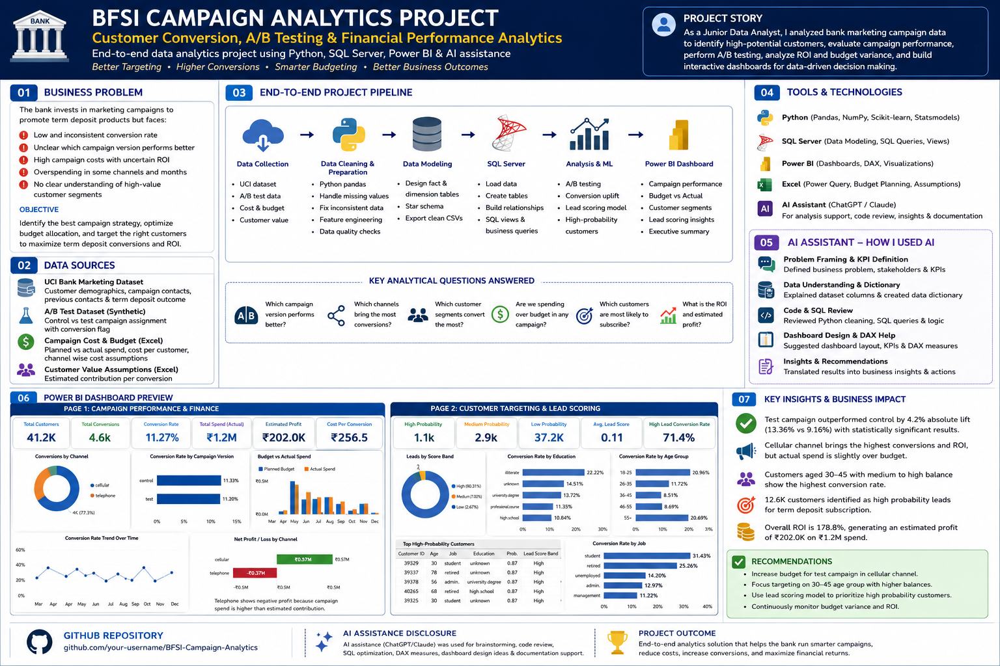

# AI-Assisted BFSI Campaign Analytics Project

## Customer Conversion, A/B Testing, Financial Performance & Lead Scoring



## 1. Project Overview

This is an end-to-end BFSI data analytics project focused on improving a bank term deposit marketing campaign.

The project analyzes customer campaign data to understand:

- Which customer segments are more likely to subscribe to a term deposit
- Which campaign version performs better: control or test
- Which channel generates stronger conversion and profitability
- Whether campaign spend is creating positive business value
- Which customers should be prioritized using lead scoring

The final output includes Python data cleaning, SQL Server analysis, A/B testing, machine learning lead scoring, and a two-page Power BI dashboard.

---

## 2. Business Problem

A bank runs marketing campaigns to promote term deposit subscriptions. However, the marketing team faces several challenges:

- Low and inconsistent conversion rate
- Unclear campaign version performance
- High campaign cost with uncertain return
- Limited visibility into high-value customer segments
- No clear prioritization strategy for customer follow-up

## Objective

The objective of this project is to help the bank identify better campaign strategies, improve customer targeting, optimize campaign budget allocation, and prioritize high-probability customers.

---

## 3. Dataset

The base dataset used in this project is the UCI Bank Marketing dataset.

The data is related to direct marketing campaigns of a Portuguese banking institution. The campaign goal is to predict whether a customer will subscribe to a bank term deposit.

Source: UCI Machine Learning Repository

Dataset used:

- `bank-additional-full.csv`

The original dataset contains 41,188 records before cleaning. After duplicate removal, the cleaned analysis dataset contains 41,176 records.

Additional assumption files were created for portfolio demonstration:

- `campaign_cost_assumptions.xlsx`
- Synthetic campaign version assignment for A/B testing
- Estimated contribution per conversion for finance analysis

---

## 4. Tools & Technologies Used

| Tool | Purpose |
|---|---|
| Python | Data cleaning, feature engineering, A/B testing, ML lead scoring |
| Pandas / NumPy | Data manipulation and transformation |
| Scikit-learn | Logistic regression lead scoring model |
| Statsmodels | A/B testing using two-proportion z-test |
| SQL Server | Data storage, business queries, analysis layer |
| Power BI | Dashboard design, DAX measures, data visualization |
| Excel | Campaign cost assumptions and business planning |
| AI Assistant | Problem framing, code review, DAX/SQL support, documentation refinement |

---

## 5. Project Workflow

```text
Raw UCI Bank Marketing Data
        ↓
Python Cleaning & Feature Engineering
        ↓
Create Customer, Campaign, Experiment & Cost Tables
        ↓
A/B Testing and Lead Scoring
        ↓
Load Clean Tables into SQL Server
        ↓
Create SQL Business Analysis Layer
        ↓
Connect SQL Server to Power BI
        ↓
Build Campaign Performance and Customer Targeting Dashboards
        ↓
Generate Business Insights and Recommendations
